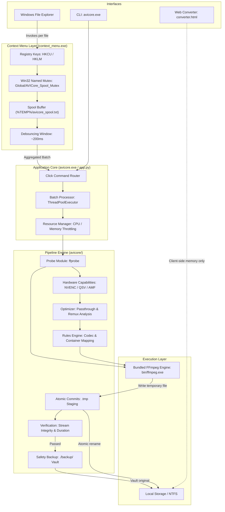

# AVI Core Architecture & System Design

This document describes the internal architecture, component interactions, and execution pipelines of **AVI Core** (version 2.0.0).

---

## 1. System Overview

AVI Core is a local-first, privacy-focused media processing system built specifically for Windows 10 and 11. It provides three interfaces that share a common media processing core:

1. **Windows File Explorer Context Menu:** Native cascading right-click shell integration for one-click operations.
2. **Command-Line Interface (`avicore`):** A scriptable terminal tool for batch conversion, inspection, and automation.
3. **Web Converter (`converter.html`):** An in-browser companion tool executing 100% client-side via HTML5 Canvas and the Web Audio API.

### Core Architecture Diagram



---

## 2. Component Breakdown

### 2.1 Context Menu Subsystem (`context_menu.py` / `context_menu.exe`)

The Windows Explorer context menu must handle Explorer's multi-select behavior cleanly. When a user selects multiple files and clicks a context menu action, Windows Explorer spawns an independent process for each selected file. Without coordination, selecting 50 files would launch 50 simultaneous processes, causing CPU exhaustion and system unresponsiveness.

AVI Core solves this with a **Named Mutex Spooling & Debouncing Protocol**:

1. **MultiSelectModel:** Configured as `Player` under `SystemFileAssociations\.{ext}\shell\AVICore`.
2. **Win32 Named Mutex:** Uses `ctypes` calling `kernel32.dll` to acquire `Global\AVICore_Spool_Mutex` (falling back to `Local\AVICore_Spool_Mutex` if unprivileged).
3. **Spool File:** Each spawned process acquires the mutex, appends its target file path to `%TEMP%\avicore_spool.txt`, and releases the mutex.
4. **Debouncing Window:** The initial process detects it is the spool leader and sleeps for ~200ms to let Explorer finish spawning sibling instances.
5. **Batch Invocation:** The master process reads the aggregated list of files from `%TEMP%\avicore_spool.txt`, clears the spool, and invokes `avicore.exe` once with the complete file list.
6. **Windowless Operation:** Compiled with PyInstaller `--noconsole` to prevent command prompt windows from flashing on the screen.

### 2.2 CLI Application Subsystem (`app.py` / `avicore.exe`)

Built using the Click framework, `app.py` provides:

* **Command Hierarchy:** Grouped into `video`, `audio`, `image`, `menu`, and `system`.
* **Global Flags:**
  * `--dry-run`: Generates and prints the complete FFmpeg command array without disk writes.
  * `--verbose`: Routes detailed DEBUG logs to `avicore.log`.
* **Graceful Signal Handling:** Installs `SIGINT` (Ctrl+C) and `SIGTERM` handlers that track in-flight temporary files (`CREATED_FILES`) and unlinks them to prevent partial artifacts.
* **Progress Reporting:** Implements real-time batch progress callbacks displaying items processed, failures, percentage, and estimated time remaining (ETA).

### 2.3 Pipeline Engine (`avicore/pipeline.py`)

Every conversion job passes through a structured, multi-stage lifecycle orchestrated by `MediaProcessingPipeline`:

```text
[Input File]
     │
     ▼
Stage 1: Probe (probe_media_file) ──► Extracts streams, codecs, HDR, dimensions
     │
     ▼
Stage 2: Capabilities (detect_capabilities) ──► Probes NVENC, QSV, AMF, CPU
     │
     ▼
Stage 3: Profile Resolution (resolve_profile) ──► Resolves preset (fast, balanced, quality)
     │
     ▼
Stage 4: Passthrough Analysis (analyze_passthrough_opportunity) ──► Checks remux eligibility
     │
     ▼
Stage 5: Metadata Resolution (resolve_metadata_rules) ──► Configures metadata passthrough
     │
     ▼
Stage 6: Command Construction (build_video_convert_command) ──► Generates exact CLI arguments
     │
     ▼
Stage 7: Execution & Two-Phase Commit ──► Safe write, verify, backup, rename
```

### 2.4 Rules Engine (`avicore/rules.py`)

The rules engine converts high-level user intent into deterministic FFmpeg parameter arrays:

* **Container Matrix:** Maps target containers (`mp4`, `mkv`, `mov`, `avi`, `webm`, `m4v`, `flv`, `ts`) to compatible default video and audio codecs.
* **GPU Encoder Resolution:** Evaluates hardware capabilities and selects the fastest supported encoder:
  1. NVIDIA NVENC (`h264_nvenc`)
  2. Intel QuickSync (`h264_qsv`)
  3. AMD AMF (`h264_amf`)
  4. Fallback to CPU (`libx264`)
* **Color Space & HDR Handling:**
  * Normal SDR content: Configured for broad compatibility with `yuv420p`, BT.709 color primaries, transfer characteristics, and matrix.
  * WebM HDR content: Applies color transfer filter `zimg=transfer=bt709:prime=bt709:colormatrix=bt709`.
* **Audio Downmixing:** Multi-channel audio (e.g., 5.1 surround) being converted to stereo applies a standard ITU downmixing matrix (`pan=stereo|FL=0.5*FC+0.707*FL+0.707*BL|FR=0.5*FC+0.707*FR+0.707*BR`) to prevent clipping.
* **Alpha Channel Compositing:** Converting transparent images (PNG, WebP with alpha) to JPEG applies a composite filter graph that replaces transparency with a clean white background (`split[s0][s1];[s0]fill=color=white[bg];[bg][s1]overlay=format=auto`).

### 2.5 Safety & Reliability Subsystem (`avicore/atomic.py`, `avicore/verifier.py`)

AVI Core adheres to a strict non-destructive storage contract:

1. **Two-Phase Commit:** All encoding output is written to a temporary buffer file (`<name>_tmp.<ext>`). The final destination is never touched during transcoding.
2. **Post-Processing Verification:** `verify_output_file` probes the generated temporary file before committing:
   * Confirms the file exists and has a non-zero byte size.
   * Probes container streams to verify the expected video/audio streams are present and decodable.
   * Compares duration against source to detect premature encoder terminations.
3. **Automated Master Vaulting:** Once verification succeeds, `backup_original_safe` moves the raw source file into a `./backup/` directory located in the source file's folder. If a duplicate exists in `./backup/`, an incremental numerical suffix (`_1`, `_2`) is appended.
4. **Atomic Rename:** Uses `shutil.move` across drives or `os.replace` within the same filesystem to replace the destination atomically.
5. **Failure Cleanup:** If FFmpeg fails or verification fails, the temporary file is unlinked immediately, and the original file remains untouched.

### 2.6 Concurrency & Scheduling (`avicore/batch.py`, `avicore/scheduler.py`, `avicore/resource_manager.py`)

* **Video Processing:** Video encoding is GPU/IO-intensive. The scheduler restricts concurrent video encodes to prevent GPU VRAM exhaustion and thread contention.
* **Image Processing:** Image processing is CPU-bound and distributed across available CPU cores via `ThreadPoolExecutor`.
* **Resource Throttling:** `ResourceManager` monitors system memory and CPU load using `psutil`, dynamically throttling concurrency if host memory dips below safe operational thresholds.

---

## 3. Directory Layout & Artifacts

| Directory / File | Role |
| :--- | :--- |
| `app.py` | CLI entry point and Click command definitions. |
| `context_menu.py` | Windows Explorer registry configuration and multi-select mutex spooler. |
| `avicore/` | Core processing package containing pipeline, rules, probing, and atomic safety logic. |
| `bin/ffmpeg.exe` | Pre-compiled static FFmpeg binary used for all media processing. |
| `build_binaries.ps1` | PowerShell build script invoking PyInstaller to produce `dist/avicore` and `dist/context_menu.exe`. |
| `installer.iss` | Inno Setup script compiling `dist/` into `AVI-Core-Setup-v2.0.0.exe`. |
| `install.ps1` / `install.bat` | Portable PowerShell installer for user or machine scope deployments. |
| `uninstall.ps1` / `uninstall.bat` | Clean uninstallation script removing registry keys and files. |
| `converter.html` | Web-based client-side converter using HTML5 Canvas & Web Audio API. |
| `%LOCALAPPDATA%\AVICore\logs\` | Runtime directory storing `avicore_context.log` and `installer.log`. |
| `%TEMP%\avicore_spool.txt` | Transient spool buffer used during Explorer multi-select actions. |
