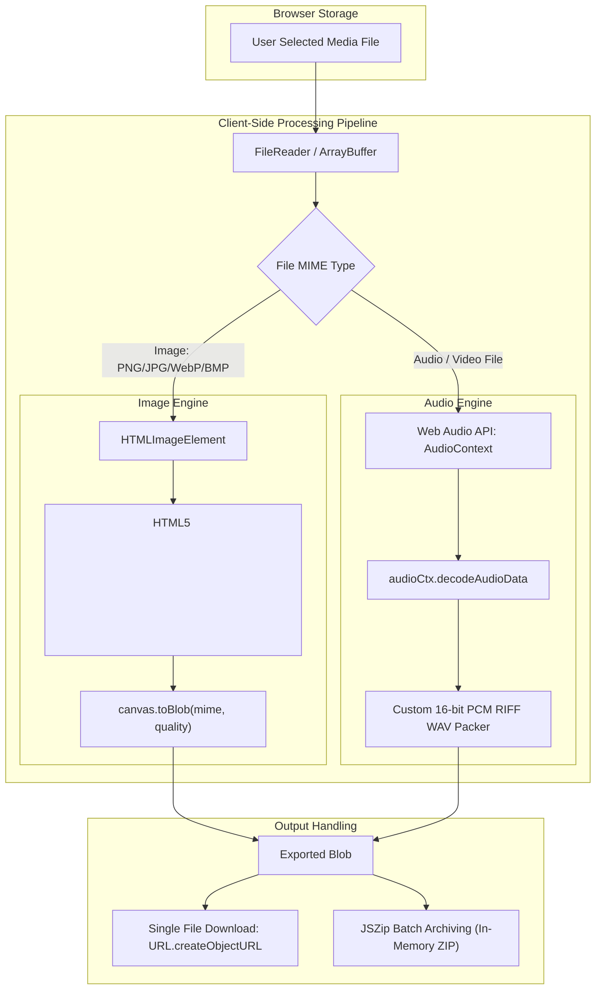

# AVI Core Web Converter

This document details the architecture, capabilities, browser engine implementation, and limitations of the **AVI Core Web Converter** (`converter.html`).

---

## 1. Overview & Privacy Architecture

The AVI Core Web Converter is a lightweight in-browser media converter accessible at:
[https://sahil524.github.io/AVI-Core/converter.html](https://sahil524.github.io/AVI-Core/converter.html)

### Key Architectural Principles:
* **100% Client-Side Processing:** Files are read, processed, and encoded entirely inside the client's web browser using native HTML5 and JavaScript APIs.
* **Zero Server Uploads:** No files are uploaded to any server, cloud bucket, or external API. Network inspections will confirm that zero multipart form uploads occur during conversion.
* **No Cookies or Tracking:** The converter operates statelessly without user accounts, authentication tokens, or tracking scripts.
* **Offline Capable:** Once the web page and its static dependencies (`react`, `framer-motion`, `jszip`) are cached by the browser, conversions execute locally without requiring an active internet connection.

---

## 2. Technical Implementation

The converter is implemented without third-party WebAssembly FFmpeg builds to minimize page weight and memory consumption:

### 2.1 Image Processing Engine (HTML5 Canvas)
1. The user's input image file is read as a data URL using `FileReader.readAsDataURL()`.
2. An `HTMLImageElement` decodes the image data.
3. The image is drawn onto an offscreen HTML5 `<canvas>` matching the original pixel dimensions (`canvas.width = img.naturalWidth`).
4. `canvas.toBlob(callback, mimeType, qualityFactor)` exports the image into the chosen target format (`image/webp`, `image/png`, or `image/jpeg`).
5. For lossy formats (WebP and JPEG), the user-selected quality percentage (1–100%) controls the quantization scale.

### 2.2 Audio Extraction Engine (Web Audio API)
1. The user's media file (audio or video) is read as raw binary data using `File.arrayBuffer()`.
2. An `AudioContext` instance processes the buffer via `audioCtx.decodeAudioData()`.
3. The resulting multi-channel `AudioBuffer` is converted to a 16-bit uncompressed linear PCM WAV container using a custom binary encoder:
   * Constructs the 44-byte standard RIFF header (`RIFF`, chunk size, `WAVE`, `fmt `).
   * Encodes audio parameters (Channels: `numOfChan`, Sample Rate: `sampleRate`, Bits Per Sample: `16`).
   * Iterates through channel data samples, clamps values between `[-1.0, 1.0]`, scales to 16-bit integers, and writes little-endian signed 16-bit PCM values into an `ArrayBuffer`.
4. The buffer is wrapped into an output `Blob` with MIME type `audio/wav`.

### 2.3 Client-Side Batch Archiving (`JSZip`)
When multiple files are converted, users can download individual converted items or click **Download All as ZIP**:
* Uses `JSZip` to build a `.zip` archive entirely in client RAM.
* Packages each output blob into the archive with its appropriate file name.
* Triggers an in-memory blob download via `URL.createObjectURL()` without server roundtrips.

---

## 3. Supported Web Conversions

| Source Category | Supported Target Formats | Notes |
| :--- | :--- | :--- |
| **PNG / JPG / WebP / BMP** | `.webp`, `.png`, `.jpg` | Adjustable quality slider (1%–100%) for `.webp` and `.jpg`. Lossless for `.png`. |
| **MP4 / WebM / MKV / MOV** | `.wav` | Extracts audio soundtrack to 16-bit uncompressed WAV. |
| **MP3 / AAC / OGG / M4A** | `.wav` | Decodes audio file to standard 16-bit uncompressed WAV. |

---

## 4. Web vs. Desktop Feature Comparison

| Capability | Web Converter (`converter.html`) | Desktop Engine (`avicore.exe`) |
| :--- | :--- | :--- |
| **Installation** | None. Runs directly in browser. | Required (Inno Setup or PowerShell). |
| **OS Compatibility** | Any OS with a modern browser (Windows, Mac, Linux). | Windows 10 & 11 (64-bit). |
| **Video Re-encoding** | ❌ Not supported. | ✅ Full transcode to MP4, MKV, MOV, WebM, AVI, etc. |
| **Lossless Fast Remux** | ❌ Not supported. | ✅ Instant stream copy (`--fast`). |
| **Audio Codecs** | `.wav` only. | `.mp3`, `.wav`, `.aac`, `.flac`, `.ogg`, `.m4a`. |
| **GPU Acceleration** | Dependent on browser canvas rendering. | Dedicated NVENC, QuickSync, AMF pipelines. |
| **File Size Limits** | Subject to browser RAM limits (~500 MB). | Unlimited (Processes 50 GB+ 4K/8K media). |
| **Explorer Menu** | ❌ None. | ✅ Native right-click integration with mutex debouncing. |

---

## 5. Known Browser Limitations

1. **Memory Allocation:** Because files are decoded in browser RAM, loading multiple multi-gigabyte video files simultaneously can cause browser tabs to crash due to heap exhaustion. For large media libraries, use the desktop CLI or Explorer context menu.
2. **Video Export:** Browsers do not provide built-in native encoders for H.264 MP4 or MKV containers without heavy WebAssembly libraries. The Web Converter focuses on client-side image optimization and audio extraction.
3. **Browser Audio Support:** Audio decoding depends on the codecs supported by your browser's `AudioContext`. While AAC, MP3, and standard WAV are supported across all modern browsers, legacy or proprietary codecs (e.g. AC3, DTS) may fail to decode in some browsers.
