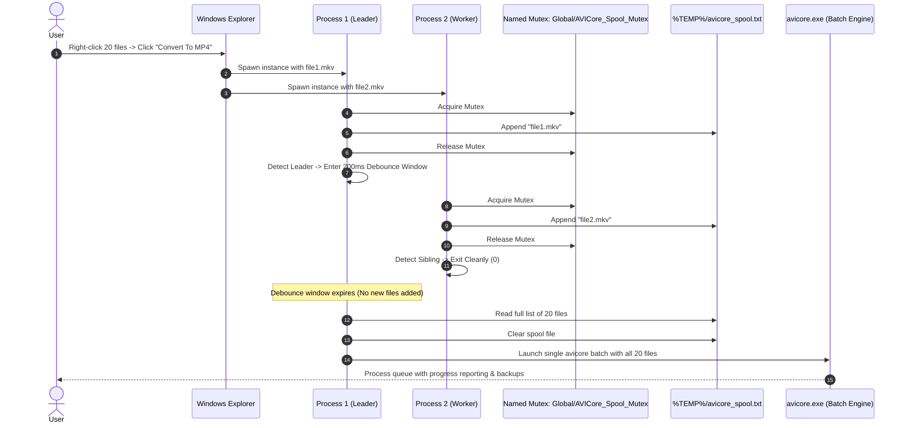

# Windows Explorer Context Menu Integration

This document describes how AVI Core integrates natively with Windows File Explorer, its multi-selection debouncing architecture, supported operations, and troubleshooting steps.

---

## 1. Overview

AVI Core provides a native cascading right-click context menu in Windows File Explorer. Normal users can convert video, audio, and photo files directly from their desktop or file folders without launching a standalone application or typing command-line instructions.

### Visual Appearance in Explorer:
When you right-click any supported file in File Explorer:

```text
📁 My_Video.mkv
  └── [Right-Click]
        ├── Open
        ├── ...
        └── 🔶 AVI Core ➔
              ├── ⚡ Fast Convert ➔  [Convert To MP4]  [Convert To MOV] ...
              ├── 🎬 Convert Video ➔ [Convert To MP4]  [Convert To WEBM] ...
              ├── 🎵 Extract Audio
              └── 🔇 Mute Audio
```

---

## 2. Supported Context Menu Operations

The menu options adapt dynamically based on the file type of the selected item:

### 2.1 Video Files (`.mp4`, `.mkv`, `.mov`, `.avi`, `.webm`, `.m4v`, `.flv`, `.ts`)

| Action | Description | Behavior |
| :--- | :--- | :--- |
| **⚡ Fast Convert** | Instant stream copy remuxing. | Repackages container (e.g. MKV to MP4) without re-encoding video/audio streams. Completes in 1–2 seconds with zero quality loss. |
| **🎬 Convert** | Full transcode with GPU acceleration. | Re-encodes using optimal hardware encoders (NVENC, QuickSync, AMF, or libx264). Preserves metadata and subtitles where possible. |
| **🎵 Extract Audio** | Rips the primary audio stream. | Extracts the soundtrack to its native format or converts to 320kbps MP3. |
| **🔇 Mute Audio** | Strips all sound from the video. | Produces `<filename>_muted.<ext>` with all audio streams removed while preserving video and subtitle tracks. |

### 2.2 Audio Files (`.mp3`, `.wav`, `.aac`, `.flac`, `.ogg`, `.m4a`)

| Action | Description | Behavior |
| :--- | :--- | :--- |
| **🎵 Convert** | High-fidelity audio transcoding. | Converts the audio file into the selected format (MP3, WAV, FLAC, AAC, OGG). |

### 2.3 Image Files (`.jpg`, `.jpeg`, `.png`, `.webp`, `.bmp`)

| Action | Description | Behavior |
| :--- | :--- | :--- |
| **🖼️ Convert** | Image format conversion. | Converts images across WebP, PNG, JPG, BMP. Converts transparent PNG/WebP to JPG with an automatic white background matte. |
| **🗜️ Compress Image** | Storage optimization. | Applies Level 9 compression to PNGs, and adaptive quantization to JPEGs and WebPs. |

---

## 3. Multi-Select Architecture & Mutex Spooling

When multiple files are selected in Windows File Explorer and a context menu command is triggered, Windows spawns an independent process instance for every individual file. If a user selects 40 files, Windows Explorer creates 40 simultaneous process instances.

Without coordination, 40 concurrent FFmpeg jobs would launch, resulting in:
* Severe CPU/RAM saturation.
* Disk I/O thrashing.
* Explorer and desktop freezing.

### How AVI Core Solves This:

AVI Core implements a **Win32 Named Mutex Debouncing Queue** inside `context_menu.py`:



1. **Win32 API Bindings:** Uses `ctypes` calling `kernel32.dll` with explicit 64-bit handle types (`CreateMutexW`, `WaitForSingleObject`, `ReleaseMutex`, `CloseHandle`).
2. **Spool Location:** File paths are written to `%TEMP%\avicore_spool.txt`.
3. **Debounce Interval:** The primary instance waits ~200ms after the last file is appended to ensure Explorer has finished dispatching all items.
4. **Windowless Dispatch:** Compiled as a windowed application (`--noconsole`), preventing Command Prompt windows from flashing during right-click actions.

---

## 4. Safety & Non-Destructive Storage

When invoked from the context menu, AVI Core guarantees file safety:

1. **Originals are Vaulted:** Before converting, the source file is copied to a `./backup/` directory located in the same folder as the source file. If a file of the same name exists in `./backup/`, an incremental counter is appended (`filename_1.ext`).
2. **Two-Phase Commit:** Output is written to a temporary staging file (`filename_tmp.ext`). Once encoding finishes, `verify_output_file` checks file size, header validity, and duration.
3. **Safe Commitment:** The temporary output is committed atomically via `shutil.move` / `os.replace`. If encoding fails, the temporary file is unlinked immediately, leaving the original file intact.

---

## 5. Registry Registration Details

AVI Core registers context menus under `SystemFileAssociations` rather than standard extension associations (`ProgID`). This ensures the menu appears regardless of which third-party media player or image viewer the user has set as default.

### Key Structure:
```text
HKEY_CURRENT_USER\Software\Classes\SystemFileAssociations\.{ext}\shell\AVICore
   ├── MUIVerb: "AVI Core"
   ├── SubCommands: ""
   ├── MultiSelectModel: "Player"
   ├── Icon: "C:\Program Files\AVI Core\logo.ico"
   └── shell\
         ├── 1_Convert\
         │     ├── MUIVerb: "Convert"
         │     └── shell\MP4\command: "context_menu.exe" "convert" "mp4" "%1"
         ├── 2_FastConvert\
         │     ├── MUIVerb: "Fast Convert"
         │     └── shell\MP4\command: "context_menu.exe" "fast-convert" "mp4" "%1"
         ├── 3_MuteAudio\
         │     └── command: "context_menu.exe" "mute" "none" "%1"
         └── 4_ExtractAudio\
               └── command: "context_menu.exe" "extract-audio" "none" "%1"
```

* **Administrator Installs:** Written to `HKEY_LOCAL_MACHINE\SOFTWARE\Classes\...`
* **Standard User Installs:** Written to `HKEY_CURRENT_USER\Software\Classes\...` (Zero UAC prompts required).

---

## 6. Registration & Unregistration Commands

### Register Context Menus:
```powershell
# Using the CLI
avicore menu install

# Directly via context_menu.exe
context_menu.exe register --silent
```

### Unregister Context Menus:
```powershell
# Using the CLI
avicore menu remove

# Directly via context_menu.exe
context_menu.exe unregister --silent
```

---

## 7. Troubleshooting

### Context menu does not appear on Windows 11
* Windows 11 collapses secondary shell extension menus under **Show more options**.
* Right-click the file and click **Show more options** (or press `Shift + F10`).
* To make AVI Core appear on the primary menu, configure Windows 11 to use the classic context menu.

### Changes do not reflect immediately after installing
* Windows Explorer caches shell extensions in memory. Refresh the shell cache by restarting Explorer:
  ```powershell
  Stop-Process -Name explorer -Force
  ```

### Inspecting Context Menu Logs
All context menu executions, mutex acquisition times, batch spool sizes, and encoding errors are logged to:
```text
%LOCALAPPDATA%\AVICore\logs\avicore_context.log
```
Open PowerShell to monitor logs in real-time:
```powershell
Get-Content "$env:LOCALAPPDATA\AVICore\logs\avicore_context.log" -Wait -Tail 30
```
